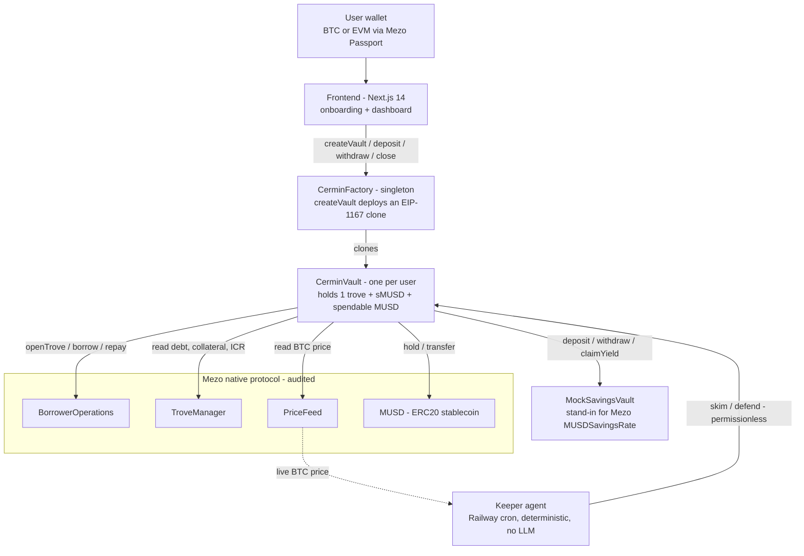
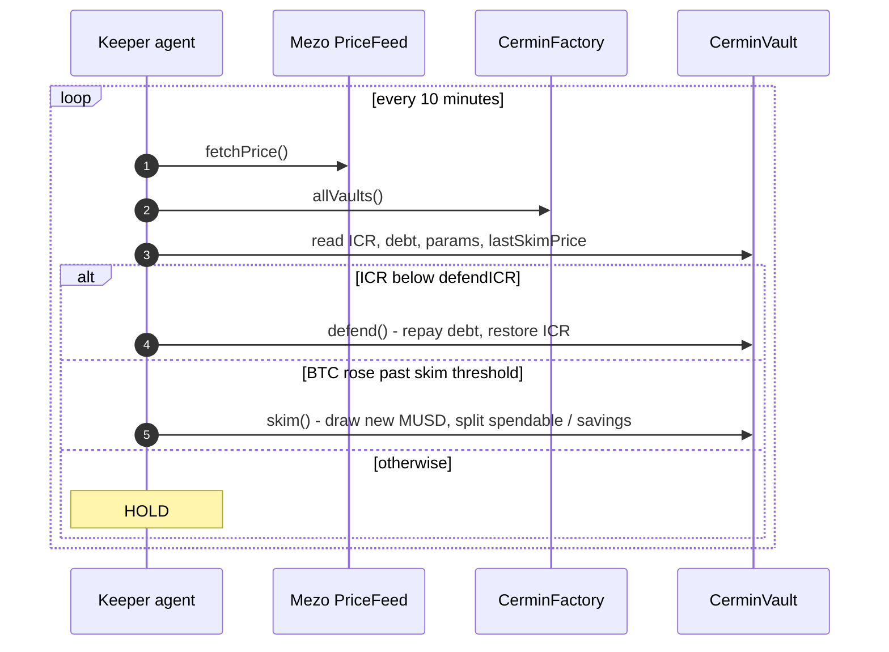

<div align="center">


# Cermin

**Your BTC stays whole. The Shadow is what you live on.**

Self-driving Bitcoin banking on Mezo. Deposit BTC once; Cermin handles borrow management, yield deployment, peak skimming, and liquidation defense automatically.

[Live App](https://cermin-gamma.vercel.app) · [Block Explorer](https://explorer.test.mezo.org/) · [Mezo Docs](https://mezo.org/docs/developers/)

Built for the Supernormal Foundation x Mezo global hackathon.

</div>

---

## Table of Contents

- [Overview](#overview)
- [Problem](#problem)
- [Solution](#solution)
- [Key Advantages](#key-advantages)
- [How It Works (Mechanism)](#how-it-works-mechanism)
- [Strategy Presets](#strategy-presets)
- [System Architecture](#system-architecture)
- [Smart Contracts (Deployed on Mezo Matsnet)](#smart-contracts-deployed-on-mezo-matsnet)
- [Mezo Contracts Used](#mezo-contracts-used)
- [What Is Mocked, and Why](#what-is-mocked-and-why)
- [Off-Chain Keeper Agent](#off-chain-keeper-agent)
- [Tech Stack](#tech-stack)
- [Repository Structure](#repository-structure)
- [Local Development](#local-development)
- [Network Information](#network-information)
- [Status and Roadmap](#status-and-roadmap)
- [License](#license)

---

## Overview

Cermin is a **consumer banking application** built on top of [Mezo](https://mezo.org), a Bitcoin-native layer for DeFi. It is deliberately **not** a new DeFi protocol. Mezo already provides the trove (CDP), the MUSD stablecoin, a price feed, and liquidations. Cermin is a **thin orchestrator** on top of those primitives that does three things:

1. Wraps one Mezo trove per user (an EIP-1167 minimal-proxy clone, because Mezo keys troves by address).
2. Automates two on-chain actions: **skim** (when BTC appreciates) and **defend** (when BTC falls toward liquidation).
3. Delivers a banking-grade user experience: deposit BTC, pick a goal and a risk preset, and live off a spendable dollar balance called the **Shadow** while your BTC is never sold.

The entire on-chain surface is **two contracts**: `CerminVault` (cloned per user) and `CerminFactory` (singleton).

---

## Problem

A Bitcoin holder faces a hard trade-off:

- **Sell BTC** to get cash, and lose the upside.
- **Hold BTC**, keep the upside, but have no spendable liquidity.

Mezo solves the first half: you can borrow the **MUSD** stablecoin against BTC at a fixed **1% APR**, without selling. But Mezo hands the user a raw lending primitive. To use it safely you must, on your own and continuously:

- Monitor your collateral ratio so you are never liquidated.
- Decide how much to borrow and when.
- Deploy the borrowed dollars into yield.
- Repay debt fast when the price drops.

That is professional treasury work pushed onto a retail user. Most people will either avoid it or get liquidated.

---

## Solution

Cermin is the **autopilot** for a Mezo position. The user provides BTC and a goal; Cermin does the rest, automatically and transparently on-chain.

When you open a vault, Cermin:

1. Opens a Mezo trove with your BTC and borrows MUSD to your target loan-to-value.
2. Splits the borrowed MUSD into a **spendable bucket** (dollars you can withdraw anytime) and a **savings position** (sMUSD, earning approximately 5% APR).
3. **Skims** new borrow capacity into your Shadow when BTC appreciates, without selling any BTC.
4. **Defends** the position by repaying debt from savings when BTC falls and the collateral ratio approaches the danger zone.
5. Returns your whole BTC whenever you close.

The dollar value you live on is the **Shadow** = spendable MUSD + the value of your sMUSD savings. Your BTC collateral is never sold, not even a satoshi.

Income comes from the **interest-rate spread** (borrow at 1% APR, save at approximately 5% APR) plus capacity skimmed during BTC appreciation.

---

## Key Advantages

| Aspect | Typical DeFi | Cermin |
|--------|--------------|--------|
| Setup | Read docs, compute LTV, deposit, manage manually | Pick a preset, deposit, done |
| Risk monitoring | You, 24/7 | Deterministic keeper + on-chain logic |
| Liquidation defense | You must stay alert | Permissionless `defend()` callable by anyone |
| Yield deployment | You choose vaults, track APRs | Auto-deployed into the MUSD savings vault |
| Custody | Varies | Non-custodial: assets sit in your own vault clone |
| Auditability | Often opaque | Fully on-chain; activity read via event logs, no indexer |

Design advantages:

- **Non-custodial.** Every asset lives in a user-owned `CerminVault` clone. The Cermin team never holds user funds.
- **Minimal attack surface.** Two custom contracts only; the heavy lifting is done by audited Mezo contracts.
- **Permissionless defense.** `defend()` is public, so the user, the keeper, or any third party can protect a vault from liquidation.
- **Strategy via parameters, not code.** Behavior diversity comes entirely from `VaultParams`, validated on-chain. No strategy code branches, no mode enums.
- **Non-upgradeable implementation.** A new version means a new factory and implementation, not a mutable proxy. No admin keys over user funds.
- **Transparent.** The dashboard activity feed is built from on-chain events (`Skimmed`, `Defended`, `SpendableWithdrawn`, `Closed`) read with `viem.getLogs()` - no centralized indexer.

---

## How It Works (Mechanism)

A vault exposes a small, deterministic set of actions. Math uses basis points (10000 = 100%); there is no floating point.

| Action | Caller | Trigger | Effect |
|--------|--------|---------|--------|
| `open` | Factory (at create) | One-time | Borrows `collateralValue x targetLTV` MUSD (must be at least 2,000 MUSD), splits per `spendableShare` into spendable + sMUSD. |
| `skim` | Anyone (keeper) | BTC rose at least `skimThresholdBps` since last skim | Draws the new borrow capacity (`maxBorrow - debt`) and splits it the same way. Grows the Shadow. |
| `defend` | Anyone (keeper) | ICR fell below `defendICR` | Repays debt from sMUSD, then spendable, to restore ICR to `defendICR` (or with a 2000 bps overshoot when below `emergencyICR`). |
| `deposit` | Owner | Manual | Adds BTC collateral, increasing the safety buffer. |
| `withdrawSpendable` | Owner | Manual | Withdraws MUSD from the spendable bucket to any recipient. |
| `close` | Owner | Manual | Repays all debt, unwinds sMUSD, returns BTC and any leftover MUSD. |

Reads (`getICR`, `getDebt`, `getCollateral`, `getShadow`) come straight from Mezo so the trove is the single source of truth.

Two-line summary of the autopilot:

- **BTC pumps** -> the trove gains borrow headroom -> `skim()` converts part of it into spendable dollars and part into savings.
- **BTC dumps** -> the collateral ratio narrows -> `defend()` repays debt to pull the ratio back to safety. BTC is never sold.

See [`contracts/src/CerminVault.sol`](./contracts/src/CerminVault.sol) for the implementation.

---

## Strategy Presets

Presets are UX constants in the frontend, passed to the factory as raw `VaultParams` and validated on-chain. Power users can pass custom parameters directly.

| Preset | Target LTV | Defend ICR | Emergency ICR | Skim threshold | Spendable share |
|--------|-----------|-----------|--------------|----------------|-----------------|
| Conservative | 40% | 170% | 140% | 8% | 30% |
| Balanced | 50% | 140% | 120% | 5% | 50% |
| Aggressive | 70% | 125% | 118% | 3% | 70% |

On-chain validation bounds: `targetLTV` in [10%, 90%], `emergencyICR` at least 115%, `defendICR` strictly above `emergencyICR`, `skimThresholdBps` in [1%, 50%], and `defendICR + 1000 bps` at most the open-time ICR (a built-in safety buffer below the opening ratio).

---

## System Architecture



Keeper decision loop (runs every 10 minutes, fully deterministic):



---

## Smart Contracts (Deployed on Mezo Matsnet)

These are Cermin's own contracts. Source lives under [`contracts/src`](./contracts/src).

| Contract | Address | Explorer | Source |
|----------|---------|----------|--------|
| `CerminFactory` | `0x58C0adee08715EEaBc61d1de43C8a15ACaB45494` | [view](https://explorer.test.mezo.org/address/0x58C0adee08715EEaBc61d1de43C8a15ACaB45494) | [CerminFactory.sol](./contracts/src/CerminFactory.sol) |
| `CerminVault` (implementation) | `0x142335F22d78bE590b6D4E3De96803b4Eb8BF431` | [view](https://explorer.test.mezo.org/address/0x142335F22d78bE590b6D4E3De96803b4Eb8BF431) | [CerminVault.sol](./contracts/src/CerminVault.sol) |
| `MockSavingsVault` | `0xbcF023FF88ed5790a999AbE760dbD9d156c690a9` | [view](https://explorer.test.mezo.org/address/0xbcF023FF88ed5790a999AbE760dbD9d156c690a9) | [MockSavingsVault.sol](./contracts/test/mocks/MockSavingsVault.sol) |

Every user vault is an EIP-1167 clone of the implementation above. To see all live vaults, call `allVaults()` on the factory.

---

## Mezo Contracts Used

Cermin orchestrates the following **native Mezo contracts** (real, not deployed by us). All addresses are on Mezo Matsnet.

| Contract | Role in Cermin | Address | Explorer |
|----------|----------------|---------|----------|
| `BorrowerOperations` | Open trove, add collateral, borrow MUSD, repay, close | `0xCdF7028ceAB81fA0C6971208e83fa7872994beE5` | [view](https://explorer.test.mezo.org/address/0xCdF7028ceAB81fA0C6971208e83fa7872994beE5) |
| `TroveManager` | Source of truth for debt, collateral, and ICR | `0xE47c80e8c23f6B4A1aE41c34837a0599D5D16bb0` | [view](https://explorer.test.mezo.org/address/0xE47c80e8c23f6B4A1aE41c34837a0599D5D16bb0) |
| `PriceFeed` | BTC/USD oracle, read via `fetchPrice()` | `0x86bCF0841622a5dAC14A313a15f96A95421b9366` | [view](https://explorer.test.mezo.org/address/0x86bCF0841622a5dAC14A313a15f96A95421b9366) |
| `MUSD` | Bitcoin-backed stablecoin (ERC20) borrowed and repaid | `0x118917a40FAF1CD7a13dB0Ef56C86De7973Ac503` | [view](https://explorer.test.mezo.org/address/0x118917a40FAF1CD7a13dB0Ef56C86De7973Ac503) |

Reference documentation and source:

- Mezo developer docs: https://mezo.org/docs/developers/
- MUSD architecture and terminology: https://mezo.org/docs/users/musd/architecture-and-terminology/
- MUSD contracts source (GitHub): https://github.com/mezo-org/musd
- `BorrowerOperations.sol` source: https://github.com/mezo-org/musd/blob/main/solidity/contracts/BorrowerOperations.sol

---

## What Is Mocked, and Why

**One contract is mocked on testnet: the savings vault.**

| Mocked contract | Reason | Real counterpart |
|-----------------|--------|------------------|
| `MockSavingsVault` ([source](./contracts/test/mocks/MockSavingsVault.sol), [deployed](https://explorer.test.mezo.org/address/0xbcF023FF88ed5790a999AbE760dbD9d156c690a9)) | Mezo has not deployed its savings contract (`MUSDSavingsRate`) on Matsnet yet, so there is nothing to deposit into on testnet. | Mezo `MUSDSavingsRate` (mainnet proxy `0xb4D498029af77680cD1eF828b967f010d06C51CC`) |

`MockSavingsVault` is a 100% behavioral mirror of Mezo's `MUSDSavingsRate`:

- `deposit(amount)` pulls MUSD and mints sMUSD 1:1.
- `withdraw(amount)` burns sMUSD and returns MUSD 1:1.
- Yield accrues outside the share balance via a pro-rata index and is claimed with `claimYield()`, exactly like the real contract.

Because the interface and behavior match, **mainnet deployment swaps this single address for Mezo's `MUSDSavingsRate`** with no change to Cermin's contract logic (it is a constructor argument on the implementation). On testnet, the keeper streams a small, time-proportional amount of MUSD into the mock to simulate the yield that Mezo's protocol-controlled value would provide on mainnet.

Everything else - trove, borrowing, repayment, price, and the stablecoin - uses **real Mezo contracts** (see the table above).

---

## Off-Chain Keeper Agent

A single deterministic TypeScript service (no LLM, no indexer, approximately 200 lines of core logic) runs on a cron loop. Each cycle it:

1. Reads the BTC price from the Mezo `PriceFeed`.
2. Lists all vaults via `factory.allVaults()` and snapshots each.
3. Decides per vault: if `ICR < defendICR` call `defend()`; else if BTC rose past `skimThresholdBps` since the last skim call `skim()`; otherwise hold.
4. Logs a one-line decision per vault.

It is hardened for production: a serial transaction queue with receipt awaiting for nonce safety, a keeper gas preflight warning, a per-vault consecutive-defend-failure counter, a cycle watchdog timeout, price sanity bounds, in-memory metrics, and a `/health` liveness endpoint. `defend()` and `skim()` are permissionless, so the keeper can never move user funds arbitrarily - it can only trigger the same safety actions any user could.

Deployed on Railway as an always-on daemon. See [`agent/`](./agent).

---

## Tech Stack

**Smart contracts**
- Solidity 0.8.33, Foundry, OpenZeppelin Contracts v5
- EIP-1167 minimal proxies (one vault clone per user)

**Off-chain agent**
- Node.js 20 LTS, TypeScript, viem v2, better-sqlite3 (decision log), pino, zod
- Deployed on Railway (cron daemon)

**Frontend**
- Next.js 14 (App Router), React 18, wagmi v2, viem v2, TanStack Query v5
- RainbowKit + Mezo Passport, Tailwind CSS
- Deployed on Vercel: https://cermin-gamma.vercel.app

---

## Repository Structure

```
cermin/
├── contracts/          Foundry workspace
│   ├── src/            CerminVault.sol, CerminFactory.sol, interfaces/
│   ├── test/           unit + integration tests, mocks/ (MockSavingsVault, etc.)
│   └── script/         Deploy.s.sol
├── agent/              deterministic keeper service (monitors, executors, health)
├── frontend/           Next.js 14 app (onboarding wizard + dashboard)
└── README.md           this file
```

---

## Local Development

**Prerequisites:** [Foundry](https://book.getfoundry.sh/), Node.js 20+.

Contracts:

```bash
cd contracts
forge build
forge test -vvv
forge snapshot
```

Deploy to Matsnet (Mezo native addresses come from environment variables; the savings vault mock is auto-deployed when `MEZO_SAVINGS_VAULT` is unset):

```bash
cd contracts
cp .env.example .env   # fill in MEZO_* addresses and PRIVATE_KEY
source .env
forge script script/Deploy.s.sol:Deploy --rpc-url $MEZO_TESTNET_RPC --private-key $PRIVATE_KEY --broadcast
```

Frontend:

```bash
cd frontend
npm install
npm run dev
```

Keeper agent:

```bash
cd agent
npm install
npm test       # node:test unit tests for the decision logic
npm run dev
```

Get testnet BTC from the faucet to interact: https://faucet.test.mezo.org/

---

## Network Information

| Field | Value |
|-------|-------|
| Network | Mezo Matsnet (testnet) |
| Chain ID | 31611 |
| RPC | https://rpc.test.mezo.org |
| Explorer | https://explorer.test.mezo.org/ |
| Faucet | https://faucet.test.mezo.org/ |

Key Mezo parameters Cermin builds on: borrow rate 1% APR fixed (locked at open), minimum debt 2,000 MUSD (1,800 + 200 MUSD gas deposit), maximum LTV 90%, liquidation at ICR below 110%, savings APR approximately 5% variable.

---

## Status and Roadmap

- Done: concept and blueprint
- Done: two-contract architecture (`CerminVault` + `CerminFactory`)
- Done: full lifecycle proven on Mezo Matsnet (open, skim, defend, close)
- Done: keeper agent live on Railway (deterministic, hardened, health-checked)
- Done: frontend live on Vercel (onboarding + dashboard)
- Planned: third-party security audit
- Planned: mainnet launch (swap mock savings vault for Mezo `MUSDSavingsRate`)
- Planned: mobile-optimized release

---

## License

Released under the [MIT License](./LICENSE).

<div align="center">

Cermin - Your BTC stays whole. The Shadow is what you live on.

</div>
